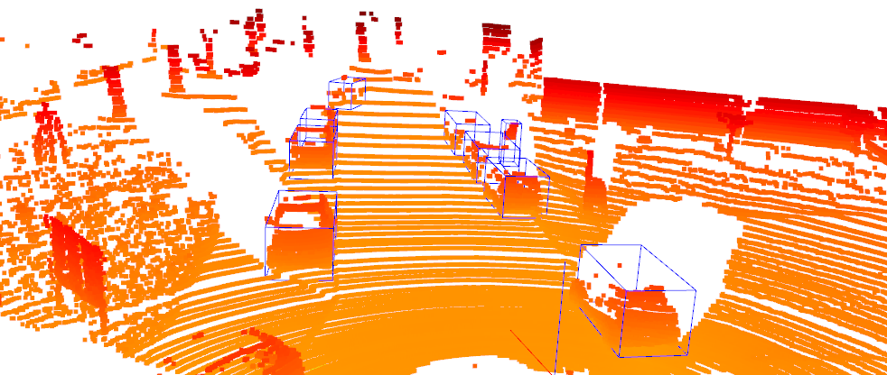
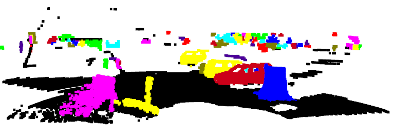
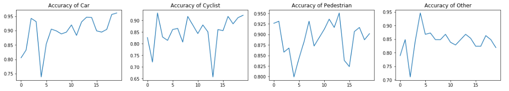
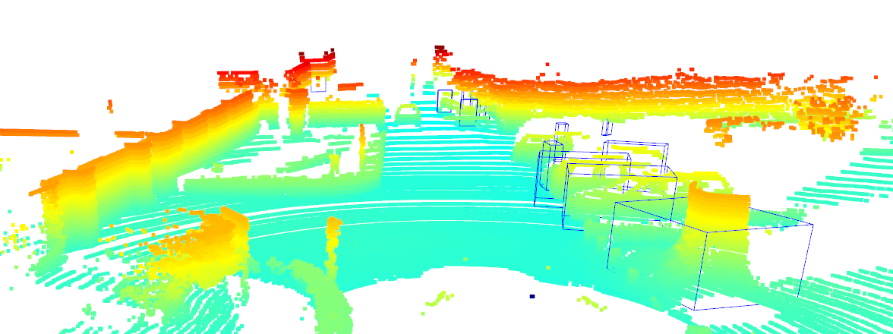

# Files

## MakeDataBaseFromKittiObjectDection.ipynb

Make data set from the ground truth.

* Decode the KITTI ground truth result.
* Cut the segment of cloud that contains each object -> to make an object classification dataset.

    

* Use mine implemenataion of clustering algorihm to test the lidar cloud segmentation.

    

## PretreatmentDataSetAndClassification.ipynb

* Pretreatment of the raw data, and build a PointNet++ to classify them. (Classfication precision reaches 90%)
Mine model could be found [here in Baidu Yun](https://pan.baidu.com/s/1GrUqz7I0CsjB_nDMYcTF2w) with extraction code '5u6q' .

    

* Implement the model to the whole KITTI set for detection task. (Traditional segmentation + Pointnet++ classification)

    

## ResultEvaluation.ipynb

* Analysis the results, show the recall and precision.
* What todo in the future.
